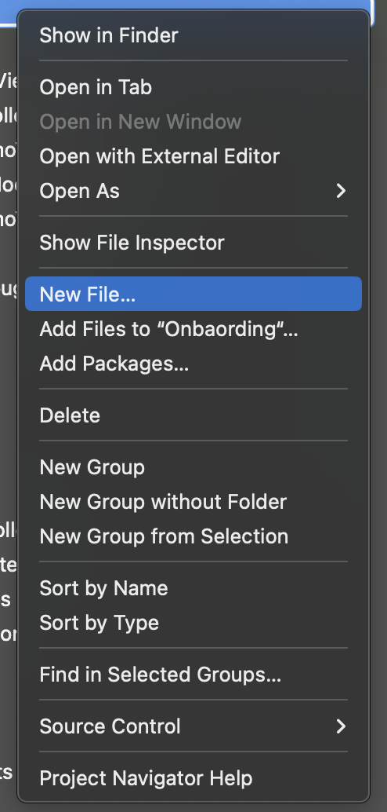
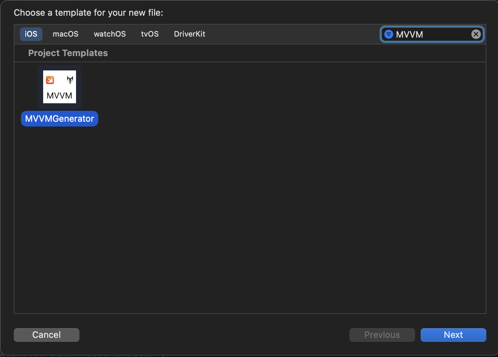
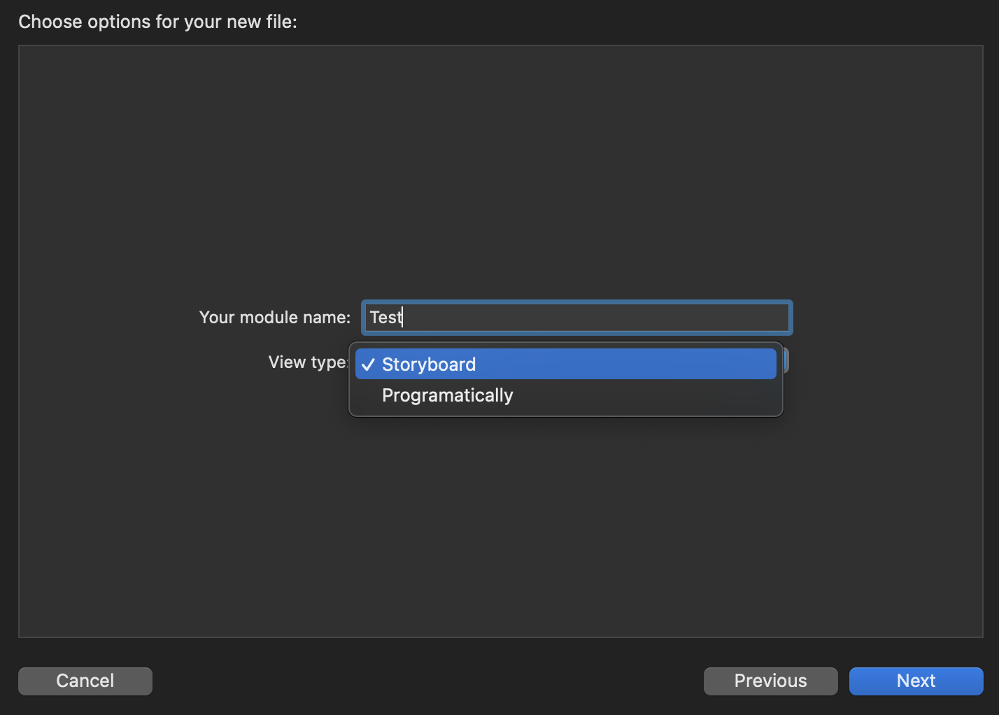
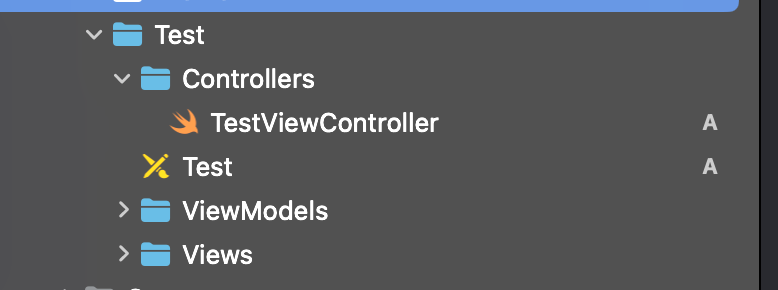
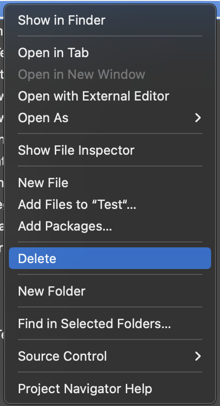
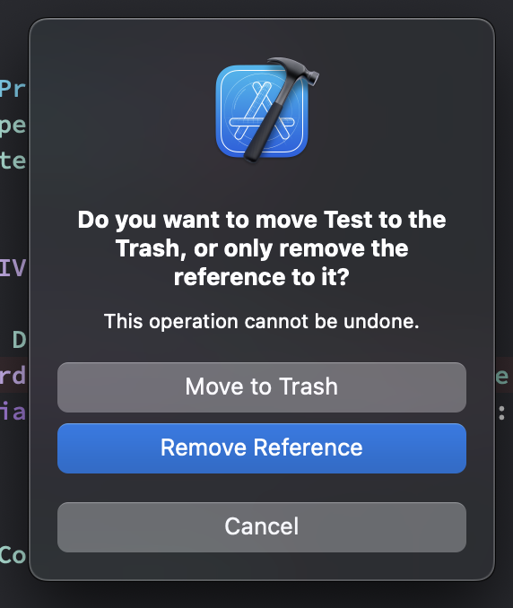
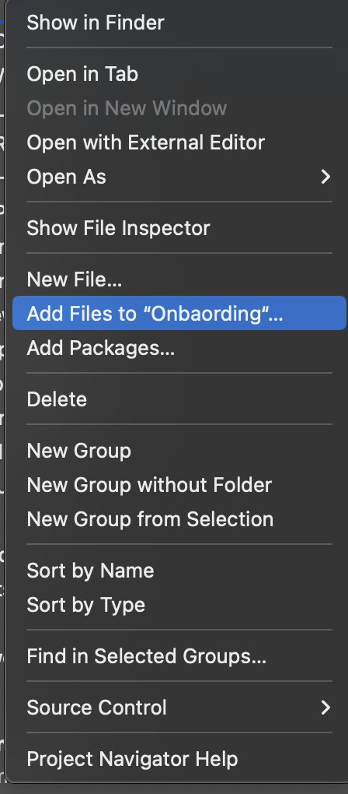

# MVVM Generator

Welcome to MVVM Generator! 
MVVM Generator is a tool to get rid of manual task of creating biolerplate. Since, nothing comes free of cost, you have to follow a few rules while generating MVVM biolderplate and this tool serves you well.

## Idea

The idea came up when having discussion with team regarding manual and labour work of creating bioler plate code every single time when new module is supposed to be added.


# Usage

* Download the zip, extract it and paste `MVVMGenerator.xctemplate` at the location:
```
/Applications/Xcode.app/Contents/Developer/Library/Xcode/Templates/Project
```

* Open Xcode and navigate to the desired folder where you want to add a new file. Click on `New File..`
<p align="center">

</p>
* In the prompt, search for `MVVM` and choose the `MVVM Generator template`
<p align="center">

</p>

* Enter the desired module name and select the view type. If you want to build the User Interface using Interface Builder, choose `Storyboard` else select `Programmatically` and click `Next`
<p align="center">

</p>

* The necessary files and folders will be generated for you. But wait! these are just references (shown in blue color)
<p align="center">

</p>

* To remove the reference, select the primary folder of the module you just created and press Delete. Choose `Remove Reference` when prompted
<p align="center">


</p>
Finally, select Add files to 'project name' and select the folder containing the files you just removed the reference of.
<p align="center">

</p>

# Contributing

Bug reports and pull requests are welcome on GitHub at https://github.com/vaibhav-nickelfox/. This project is intended to be a safe, welcoming space for collaboration, and contributors are expected to adhere to the Contributor Covenant code of conduct.

# License

The template is available as open source under the terms of the [MIT License](https://opensource.org/licenses/MIT).
